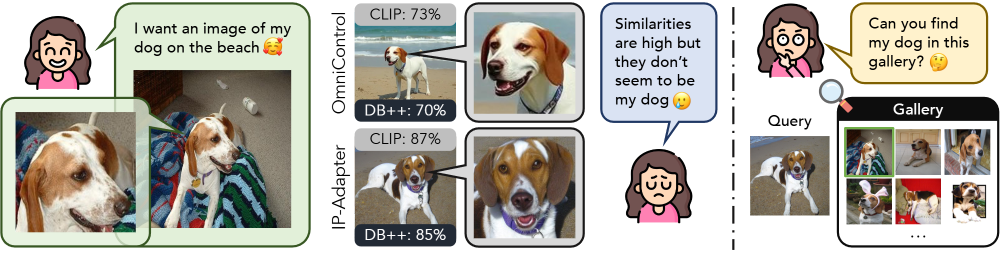

# Finer-Personalization-Rank
<div align="center">

</div>

Finer-Personalization Rank offers a benchmark for personalized image generation that is better aligned to measure identity-preservation in generation.
- Instead of measuring similarity between reference and generated images, we propose an additional gallery set with instance and similar instance examples. Specifically, we measure the generation capability of identity-preservation by the ability to match to same subject given similar but negative examples.
- We also propose using data-specific models to evaluate rather than general, semantic models like DINO and CLIP.
- We evaluate using a ReID dataset, Stanford Cars, and CUB.

## Dataset

We used parts of three datasets: Stanford Cars, CUB, and WildlifeReID-10k. CUB(https://www.kaggle.com/datasets/coolerextreme/cub-200-2011) and WildlifeReID-10k(https://www.kaggle.com/datasets/wildlifedatasets/wildlifereid-10k) need to be downloaded seperately first if to be used. 

We include scripts to format data.

Ex. CUB

```bash
python data_load_scripts/load_cub_data.py --root_path /path/to/your/cub/root --out_path your/output/path
```

Optional:
Then manually remove data if needed and run:
```bash
python data_load_scripts/filter_removed_data.py --root_path your/filter/data/path
python data_load_scripts/copy_formated_data.py --root_path your/filter/data/path --output_path new/output/path
```
Data is put into the following format:
```text
CUB_example_format
├── data
│   ├── sparrow
│   │   ├── black_throated_sparrow
│   │   │   ├── gallery
│   │   │   │   ├── 0.png
│   │   │   │   ├── ...
│   │   │   ├── train
│   │   │   │   ├── 0.png
│   │   │   │   ├── ...
│   │   ├── ... 
│   ├── ...
├── train_data.csv
├── gallery_data.csv
```
This format is not necassary to make evaluation scripts work, but is used to run generation scripts.

## Run Generation Scripts
For IP-Adapters and Flux-Kontext make sure to fill in `TARGET_PATH = "/your/path"`.
Example running dreambooth script on loaded CUB data from above:

```bash
python generate_scripts/run_all_dreambooths.py --root /path/to/CUB_example_format --with_prior_pres
```

all provided generation scripts will result in format of:
```text
CUB_example_format
├── data
│   ├── sparrow
│   │   ├── black_throated_sparrow
│   │   │   ├── gallery
│   │   │   │   ├── 0.png
│   │   │   │   ├── ...
│   │   │   ├── train
│   │   │   │   ├── 0.png
│   │   │   │   ├── ...
│   │   ├── ...
│   │   │   ├── generated_images
│   │   │   │   ├── 0.png
│   │   │   │   ├── ...
│   │   ├── ... 
│   ├── ...
├── train_data.csv
├── gallery_data.csv
├── generated_data.csv
```


## Running Evaluation Script

If wanting to use car evaluation model, train classifier model by running:
```bash
python evaluation/cars_classifier.py
```
If wanting to use GPT scoring, in dreambench_plus_eval.py fill in Open-ai api key at `OPENAI_KEY = "your key"`.

After running all generation scripts, fill in a JSON config file, examples can be seen in evaluation/configs.

Then run:

```bash
python evaluation/get_results.py --config /path/to/your/config --save_path /path/to/save/results.csv 
```
This will give you results for each model at species/class granularity.


